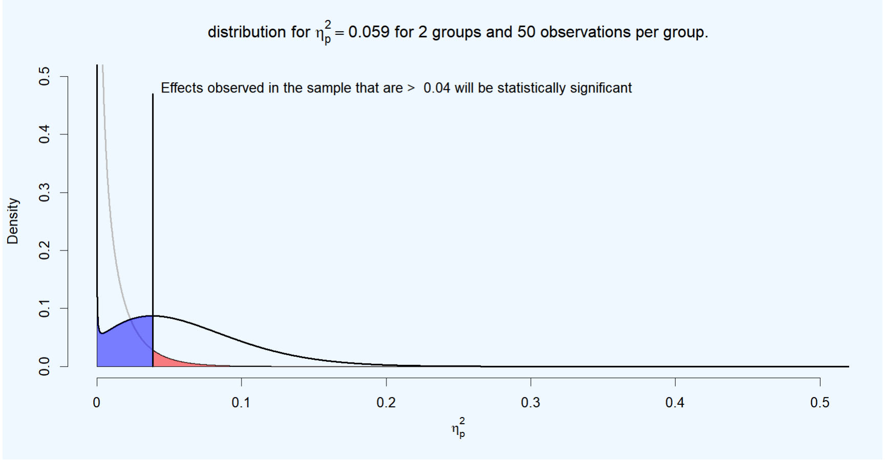

# Shiny Apps Repository of Daniel Lakens

This is a collection of Shiny Apps that accompany papers or that are used for education. These files are made available in case the Shiny server on which they run is unavailable. You can download the files and run them on your own computer using RStudio. Most apps have both a single app.R file you can run, or a ui.R and server.R file. 

### ANOVA_power: Software to simulate power for factorial ANOVA designs

[Get the files](https://github.com/Lakens/shiny_apps/tree/master/anova_power)

[Read the paper](https://psyarxiv.com/baxsf)

### Too True to be Bad: When Sets of Studies With Significant and Nonsignificant Findings Are Probably True

[Get the files](https://github.com/Lakens/shiny_apps/tree/master/mixed_results_likelihood)

[Read the paper](https://journals.sagepub.com/doi/full/10.1177/1948550617693058)

### Comparison for Equivalence Testing and the Second Generation P-value

[Get the files](https://github.com/Lakens/shiny_apps/tree/master/TOST_vs_SGPV)

[Read the paper](https://psyarxiv.com/7k6ay)

### Plot F-distribution, p-values, and power for F-test

[Get the files](https://github.com/Lakens/shiny_apps/tree/master/f_p_power)

### Plot Cohen's d-distribution, p-values, and power for t-test

[Get the files](https://github.com/Lakens/shiny_apps/tree/master/d_p_power)

### A practical guide to justifying your alpha level

For an explanation why researchers should justify their alpha levels, see:

Lakens, D., Adolfi, F. G., Albers, C. J., Anvari, F., Apps, M. A. J., Argamon, S. E., … Zwaan, R. A. (2018). Justify your alpha. Nature Human Behaviour, 2, 168–171.

For a short introduction in why to lower your alpha level as a function of the sample size, see my [blog post](http://daniellakens.blogspot.com/2018/12/testing-whether-observed-data-should.html). For a short introduction on why and how to balance or minimize error rates, see my [other blog post](http://daniellakens.blogspot.com/2019/05/justifying-your-alpha-by-minimizing-or.html)

[Get the files](https://github.com/Lakens/shiny_apps/tree/master/jya)

